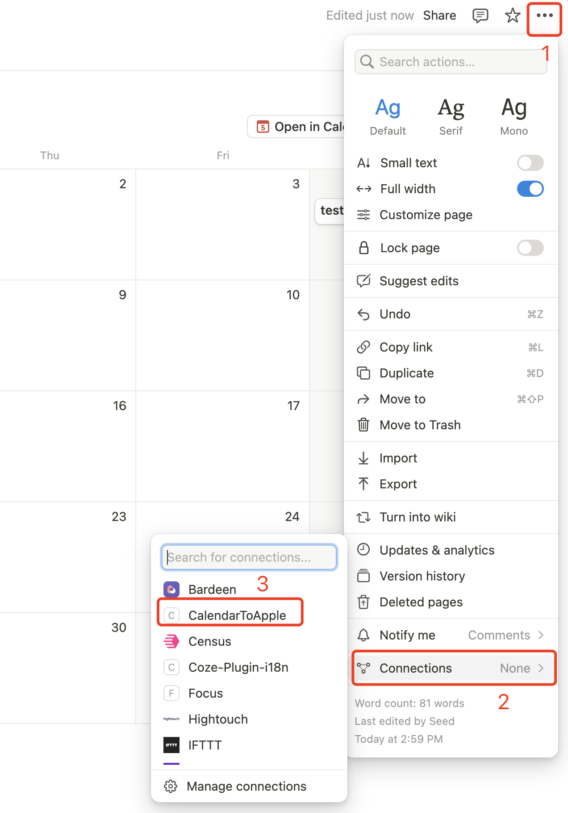
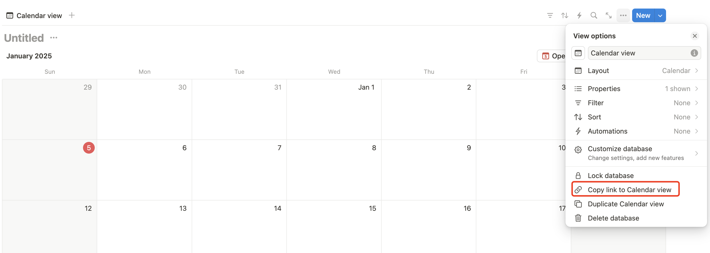
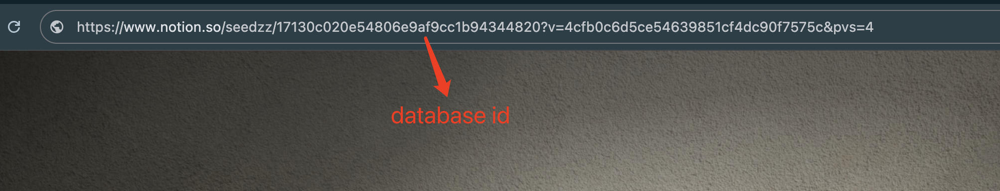

# Notion calendar to Apple

Based on Next.js, provides a self-deployed application to synchronize the calendar in notion to Apple Calendar.

 

[Chinese](README_CN.md)

## Features
* Deploy and use quickly with Vercel
* Create an Apple Calendar subscription URL for the calendar in Notion
* Supports synchronizing multiple Notion calendars
* Cache Notion Calendar, regular updates
* Provides a web page to show the synchronized Notion calendars

## Quick Start
1. Access [Notion Integration](https://www.notion.so/profile/integrations/form/new-integration)，create a new integration，copy and save the Internal Integration Secret for later  **NOTION_API_KEY**.
2. Go to the page where the calendar is located in Notion and add the integration you created above in the **Connection**.
    
3. Copy the database link of the calendar in Notion
    
4. Get the **DATABASE_ID** in the Calendar Database link
    
5. Click the button on the right to start deploying to Vercel: You can log in directly with your Github account, and remember to fill **NOTION_API_KEY** 和 **NOTION_DATABASE_ID** in the environment variables page.
6. Visit the home page according to the domain name assigned by Vercel, and you can see the pulled notion calendar data (it is recommended to customize the domain name for subsequent access)
7. Open Calendar on iPhone or iPad, add a new calendar, and select **Add Subscription Calendar**
8. Subscribe URL: Enter **{vercel access domain}/api/calendar/{NOTION_DATABASE_ID}** to complete the subscription URL

## Environment variables
* `NOTION_API_KEY` (required)：Internal Integration Secret key
* `NOTION_DATABASE_ID` (required)：The notion calendar database id that you want to synchronize, multiple calendars are separated by **,**
* `TIMEZONE`：Calendar time zone, default is **Asia/Shanghai**
* `CACHE_UPDATE_INTERVAL_MINUTES`：notion calendar synchronization period, default is **60 minutes**
* `CALENDAR_START_DATE`：Calendar event start date, all will be pulled by default if not config, configuration reference **[Notion Database Filter Date](https://developers.notion.com/reference/post-database-query-filter#date)**

## License
MIT © [Seed Zheng](https://blog.seedzz.top/about)