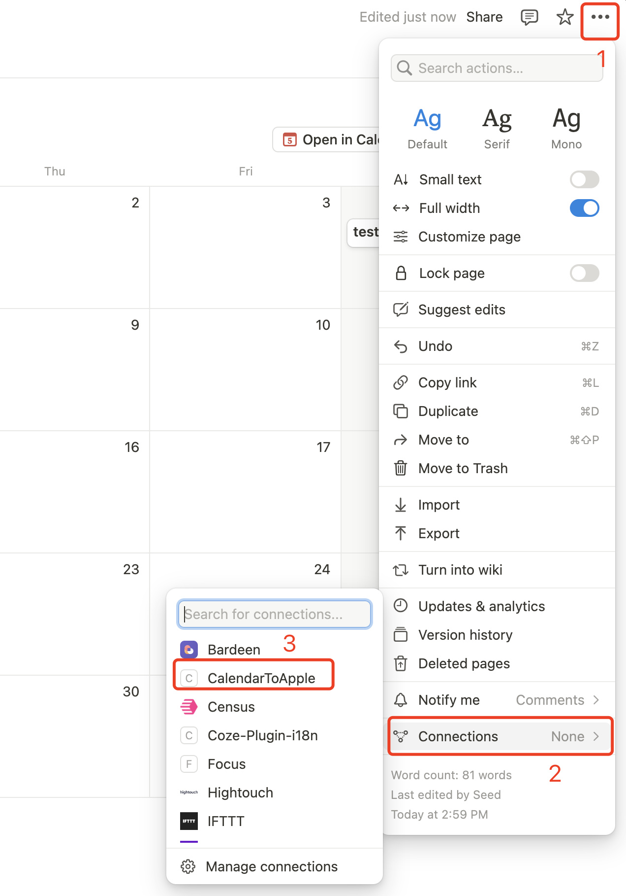

# Notion calendar to Apple

基于Next.js开发的，提供自部署的将notion中的日历同步到苹果日历的应用。

 

## 功能特性
* 使用Vercel快速部署和使用
* 为Notion中的日历创建苹果日历订阅url
* 支持同步多个Notion日历
* 定时同步更新，间隔可配置
* 提供页面展示同步的Notion日历事件信息

## 快速使用
1. 去 [Notion集成](https://www.notion.so/profile/integrations/form/new-integration) 创建一个继承，保存Internal Integration Secret，作为后续的**NOTION_API_KEY**使用
2. 到Notion中的日历所在的页面，在连接处添加上述你创建的集成
    
3. 到Notion中复制日历的数据库链接
    
4. 获取日历数据库链接中的**DATABASE_ID**
    
5. 点击右侧按钮开始部署到Vercel： 直接使用 Github 账号登陆即可，记得在环境变量页填入 **NOTION_API_KEY** 和 **NOTION_DATABASE_ID**
6. 根据Vercel分配的域名访问首页，即可看到拉取到的notion日历数据（建议自定义域名，方便后续访问）
7. 打开iphone或者ipad中的日历，添加一个新的日历，选择 **添加订阅日历**
8. 订阅url输入 **{vercel访问域名}/api/calendar/{NOTION_DATABASE_ID}** 即可完成订阅

## 环境变量
* `NOTION_API_KEY` (必传)：notion集成api key
* `NOTION_DATABASE_ID` (必传)：想要同步的notion日历数据库id，多个日历以**,**分隔
* `TIMEZONE`：日历时区，默认为 **Asia/Shanghai**
* `CRON_INTERVAL`：notion日历同步周期，默认为 **60分钟**
* `CALENDAR_START_DATE`：日历事件开始日期，不配置默认拉取全部，配置参考 **[Notion Database Filter Date](https://developers.notion.com/reference/post-database-query-filter#date)**

## License
MIT © 